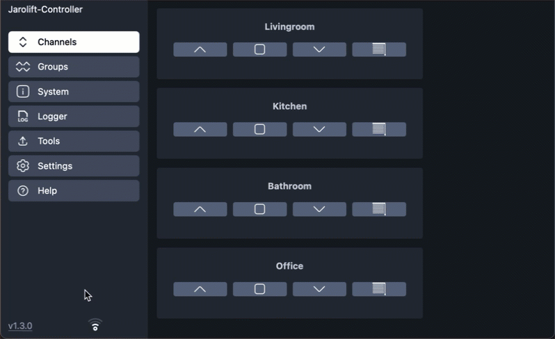

<div align="center">


<h3 style="text-align: center;">ESP32-Jarolift-Controller</h3>
</div>

-----

**[🇩🇪 Deutsche Version der Beschreibung](README_DE.md)**

-----

<div align="center">

[](https://github.com/dewenni/ESP32-Jarolift-Controller/releases/latest)


[](https://github.com/dewenni/ESP32-Jarolift-Controller/stargazers/)

[](https://github.com/dewenni/ESP32-Jarolift-Controller/stargazers/)

</div>

-----

<div align="center">
If you like this project, feel free to push the <b>[Star ⭐️]</b> button and click <b>[Watch 👁]</b> to stay updated.
<br><br>
And if you'd like to support my work, you can also<p>

[](https://github.com/sponsors/dewenni)

</div>

-----

# ESP32-Jarolift-Controller

Controlling Jarolift(TM) TDEF 433MHz radio shutters via **ESP32** and **CC1101** Transceiver Module in asynchronous mode.

## Features

- **Web-based User Interface (WebUI):**  
A modern, mobile-friendly interface for easy configuration and control.

- **MQTT Support:**  
Communication and control of devices are handled via MQTT, a lightweight and reliable messaging protocol.

- **HomeAssistant Integration:**  
Automatic device discovery in HomeAssistant through MQTT Auto Discovery for seamless integration.

- **Support for up to 16 Roller Shutters:**  
Control up to 16 roller shutters with ease, all managed through the WebUI and MQTT.

- **Support for up to 6 Roller Shutter Groups:**  
define shutter groups to control several shutters at once

- **Timer function**  
stand alone timer function with fixed time, sunrise or sunset as trigger.

### WebUI-Demo

For a first impression of the functions and the WebUI, a limited demo is also available.  
This can be accessed via the following link: [WebUI-DEMO](https://dewenni.github.io/ESP32-Jarolift-Controller/)

Experimental version.
Use at your own risk. For private/educational use only. (Keeloq algorithm licensed only to TI Microcontrollers)
This project is not affiliated in any way with the vendor of the Jarolift components.
Jarolift is a Trademark of Schöneberger Rolladenfabrik GmbH & Co. KG

This version is for an ESP32 and is based on ideas and code from [madmartin/Jarolift_MQTT](https://github.com/madmartin/Jarolift_MQTT).

### Project Homepage, Forum and Author

The original control code was written from Steffen Hille in Nov, 2017

The project home is here: [Project Home](http://www.bastelbudenbuben.de/2017/04/25/protokollanalyse-von-jarolift-tdef-motoren/)

-----

# Table of Contents

- [Hardware](#hardware)
  - [ESP32](#esp32)
  - [CC1101 433Mhz](#cc1101-433mhz)
  - [Optional: Ethernet Module W5500](#optional-ethernet-module-w5500)
- [Getting started](#getting-started)
  - [Platform-IO](#platform-io)
  - [ESP-Flash-Tool](#esp-flash-tool)
  - [OTA-Updates](#ota-updates)
  - [Setup-Mode](#setup-mode)
  - [Configuration](#configuration)
  - [Filemanager](#filemanager)
  - [Teach-in of roller shutters](#teach-in-of-roller-shutters)
  - [Migration](#migration)
- [WebUI](#webui)
  - [Channels](#channels)
  - [Groups](#groups)
  - [Timer](#timer)
- [MQTT](#mqtt)
  - [Commands](#commands)
  - [Status](#status)
  - [Home Assistant](#home-assistant)
- [Optional Communication](#optional-communication)
  - [WebUI-Logger](#webui-logger)
  - [Telnet](#telnet)

-----

# Hardware

you can find working setups from users of this project here: [working setups](https://github.com/dewenni/ESP32-Jarolift-Controller/discussions/34)

## ESP32

The firmware is currently only available for the following chips:

**Standard ESP32 (Xtensa® 32-bit LX6, 4MB Flash)**

- `ESP32-WROOM-32 series` (e.g. WROOM, WROOM-32D, WROOM-32U)
- `ESP32-WROVER series` (e.g. WROVER, WROVER-B, WROVER-IE)
- `ESP32-MINI series`
- `ESP32-S2 series`
- `ESP32-S3 series`
- `ESP32-C3 series`

**Not compatible:**

- `ESP32-H series`
- `YB-ESP32-S3-ETH`
- `WT32-ETH01`

## CC1101 433Mhz

**compatible and tested products:**

- `EBYTE E07-M1101D-SMA V2.0`
- `CC1101 433MHZ Green`


a standard SPI GPIO configuration is:

| CC1101-Signal| ESP-GPIO|
|--------------|---------|
| VCC          | --      |
| GND          | --      |
| GD0          | 21      |
| GD2          | 22      |
| SCK/CLK      | 18      |
| MOSI         | 23      |
| MISO         | 19      |
| CS(N)        | 5       |


 


example with ESP32-Mini and CC1101


example for direct replacement with ESP32-Mini and the custom board from M. Maywald

## Optional: Ethernet Module W5500

It is also possible to connect a W5500 Ethernet module to the Board or a generic ESP32.  

**compatible and tested products:**

- `W5500` HanRun (HR911105A)
- `W5500 Lite` HanRun (HR961160C)


> [!IMPORTANT]
> The connection cable should be as short as possible (approx 10cm)

Example for generic ESP32-Mini (Standard SPI port is used by CC1101)

| Signal| GPIO |
|-------|------|
| CLK   | 25   |
| MOSI  | 26   |
| MISO  | 27   |
| CS    | 32   |
| INT   | 33   |
| RST   | 17   |

-----

# Getting started

## Platform-IO

The software is created with [Visual Studio Code](https://code.visualstudio.com) and the [pioarduino-Plugin](https://github.com/pioarduino/pioarduino-vscode-ide).  
After installing the software you can clone the project from GitHub or you can download it as zip and open it in PlatformIO.
Then adapt the `upload_port` and corresponding settings in `platformio.ini` to your USB-to-serial Adapter and upload the code to the ESP.

> [!NOTE]
> Python must also be installed in order to fully compile the project. The scripts folder contains, for instance, scripts for creating the web pages that are called when the project is compiled.

## ESP-Flash-Tool

In the releases, you can find also the binary of the Software. If you don´t want to use PlatformIO, you can also use the `esp32_jarolift_controller_flash_vx.x.x.bin` file and flash it directly on the ESP. This bin-file is already a merge with bootloader.bin, partitions.bin and the application.bin. You can flash this image an the ESP at address 0x00.  

**Windows**  
There are several tools available to flash binaries to the ESP.  
One of them is [espressif-flash-download-tool](https://www.espressif.com/en/support/download/other-tools)

**macOS/Linux**  
for Mac it is hard to find a tool with a graphical UI, but you can simple use the esptool.py:

1. open Terminal
2. install esptool: `pip install esptool`  
3. optional get the install path: `which esptool.py`  
4. set path: `export PATH="$PATH:/<path>/esptool.py"` (<- change <path> with result from 3.)
5. goto path where the bin file is located
6. get Device String: `ls /dev/tty* | grep usb` (use this in next Step for <UPLOAD-PORT>)
7. upload: `esptool.py -p <UPLOAD-PORT> write_flash 0x00 esp32_jarolift_controller_flash_vx.x.x.bin`  

## OTA-Updates

### local Web OTA-Update

The first option is, to download the ota Update File from the latest release at GitHub.
After you have downloaded this to your computer, you can perform a update with the embedded WebUI OTA-Update.
You can find the update function in the "Tools" Tab of the WebUI.

here you can choose "Firmware" and select the `esp32_jarolift_controller_ota_update_vx.x.x.bin` file from the release section


### GitHub OTA-Update

since Version 1.4.0 it is also possible to update the controller directly in the WebUI without downloading the .bin file before.
If you click on the Version info on the bottom left, a dialog will open. If there is a new version available, you can directly initiate the update here. It will then automatically download and install the latest release from github!



### PlatformIO OTA-Update

But it is also possible to download the software wireless with platformio.
You only have to change the `upload_port` settings in `platformio.ini`

There are two predefined Options:

- OPTION 1: direct cable upload
- OPTION 2: wireless OTA Update

## Setup Mode

A `Setup Mode` is available. Setup mode is activated when the ESP is restarted **5** times.
A maximum of 5 seconds may elapse after each restart.

Example: restart 1/5 - wait 2s - restart 2/5 - wait 2s - restart 3/5 - wait 2s - restart 4/5 - wait 2s - restart /5/5 => Setup-Mode

The "Setup Mode" will also activated if there is no valid wifi and no valid ETH connection configured.

If the ESP goes into "Setup Mode", it will automatically create a own network access point with ssid  
📶 `"ESP32_Jarolift"`  
After you are connected to this network, you can open the webUI on ip-address  
**"<http://192.168.4.1>"**

## Configuration

Here you can setup all the configuration that fits to your heating system and your infrastructure.

- **WiFi**  
enter your WiFi credentials to connect the ESP to your network

- **Ethernet W5500**  
use Ethernet connection based on W5500 to connect the ESP to your network

- **Authentication**  
you can activate the authentication feature and configure user and password.

- **NTP Server**  
the ESP can connect to a NTP server to get the right Time information.
The default Time-Zone should fit if you are located in germany. Otherwise you can change it manually

- **MQTT**  
here you can activate the MQTT communication and enter mandatory parameters
All the parameters are mandatory!

- **GPIO**  
Here you can configure the GPIO to connect the CC1101 to the ESP32

- **Jarolift**  
here you have to configure some Jarolift specific protocol settings

- **Shutter**  
here you can configure each shutter with individual name

- **Group**  
here you can define optional shutter-groups

- **Remotes**  

  You can register some of your existing jarolift remote controls here.
  This can be helpful if you want to recognize and react on the commands of these remote controls.

  You can assign any name you like to the remote control. This is also output in the MQTT message.

  The upper 6 digits of the 8-digit serial number must be entered for the serial number. The serial number can be found in the logbook by pressing the remote control near the controller. A message like this should then appear in the log:  
  `I (220364) JARO: received remote signal | serial: 0c7c00 | ch: 3 | cmd: 0x8, | rssi: -96 dbm`  
  
  With the help of the bit mask and the dialogue behind it, it is then possible to define which shutters are assigned to this remote control, as with the groups. The status of these shutters is then updated depending on the signal received.
  This means that the status of the roller shutters can be updated even if they are not operated via the ESP controller but via the original remote control.
  
  But please be aware that this will not be 100% reliable.

- **Language**  
There are two languages available. Choose what you prefer.
The language take effect on the webUI and also on the mqtt messages!

> [!NOTE]
> All settings are automatically saved when changes are made

> [!IMPORTANT]
> Changes to GPIO or Jarolift settings require a restart!


## Filemanager

there is also a builtin file manager to open (show), download (export) and upload (import) the configuration file.
The configuration is stored in the ```config.json``` file. To backup and restore the configuration you can download and upload this file.


## Teach-in of roller shutters

There are basically several ways to teach-in a roller shutter.
There are the same options as when using the original remote controls.

### Teach-in by pressing the teach-in button on the motor

Every TDEF motor has a button for programming new remote controls.
If you press this button, the motor confirms the learning process with a vibration.

> [!TIP]
> If you cannot reach the button, you can also switch the motor off for a few seconds. For example, by briefly switching off the fuse.

Now press the corresponding ‘Learn button’ in the WebUI in the settings for the respective roller shutter within 5 seconds.
If the roller shutter has been successfully programmed, the motor will vibrate again.

### Programming by copying an existing radio code

Alternatively, you can also use an already programmed remote control and ‘copy’ it.
To do this, press the UP and DOWN buttons simultaneously on the already programmed transmitter. Then, on this transmitter, press the STOP button
eight times on this transmitter. The motor will vibrate briefly to confirm.

Now press the corresponding ‘Learn button’ in the WebUI in the settings for the respective roller shutter within 5 seconds.
If the roller shutter has been successfully learnt, the motor will vibrate again.

## Migration

It is possible to migrate from a latest version of [madmartin/Jarolift_MQTT](https://github.com/madmartin/Jarolift_MQTT) to this project.

### Get a working Setup of this Project

- get a working version of this project up and running
- set the right GPIO settings for CC1101
- set the Master Keys
- set the Log-Level in the Logger of the WebUI to "Debug"

### Get the right serial number

- execute a shutter UP command of "old" Setup `(madmartin/Jarolift_MQTT)` for **channel 0!**.
- now you should see a debug message of this command in the Logger of the WebUI.  
It contains a message with `I (220364) JARO: received remote signal | serial: 0c7c00 | ch: 3 | cmd: 0x8, | rssi: -96 dbm` 
This **serial** number should be the same as configured in the WebUI of the "old" setup, but now we are sure to have the right one.
- set this serial in the WebUI of this project

### Get the right Device Counter

- read the actual device counter of the "old" setup from the System Page of the WebUI.
- set the same Device Counter value in the settings of this project.

### define the Shutter

- define the same shutter as in the "old" setup and activate them.

finished!  
now restart the ESP and test it.  
After restarting, first check whether the device counter has been read correctly from the EEPROM. Only continue testing if this is the case.
If everything done correct, all shutters should work like before. If not, some setting is wrong or you haven´t used the latest version of `(madmartin/Jarolift_MQTT)`. In that case I would prefer to set a new Serial number, reset the Device Counter und learn the shutter again.

-----

# WebUI

The WebUI is responsive and also offers a mobile layout.


(Desktop Version)


(Mobile Version)

## Channels

Once the roller shutters have been configured and activated, they can also be controlled directly in the WebUI.


## Groups

The groups that are configured in the settings can also be operated directly in the WebUI in the same way as the individual roller shutters.


## Timer

The timer function enables the automatic control of individual roller shutters or a selection of several roller shutters as a group.
A fixed time can be specified as a trigger, or sunrise or sunset with an optional time offset.


The selection of roller shutters is supported by an additional dialogue. All configured and activated roller shutters are displayed there. These can be selected there and the bitmask is then automatically created from them.


-----

# MQTT

## Commands

### Shutter

To control the shutters you can use the following mqtt commands.
{UP, OPEN, 0} means, that you can use one of the listed payload commands.

```text
command:    restart ESP
topic:      ../cmd/restart
payload:    none

command:    shutter up
topic:      ../cmd/shutter/1 ... cmd/shutter/16
payload:    {UP, OPEN, 0}

command:    shutter down
topic:      ../cmd/shutter/1 ... cmd/shutter/16
payload:    {DOWN, CLOSE, 1}

command:    shutter stop
topic:      ../cmd/shutter/1 ... cmd/shutter/16
payload:    {STOP, 2}

command:    shutter shade
topic:      ../cmd/shutter/1 ... cmd/shutter/16
payload:    {SHADE, 3}

```

### predefined Group

To control shutters a group you can use the following mqtt commands.
{UP, OPEN, 0} means, that you can use one of the listed payload commands.

```text

command:    group up
topic:      ../cmd/group/1 ... cmd/group/6
payload:    {UP, OPEN, 0}

command:    group down
topic:      ../cmd/group/1 ... cmd/group/6
payload:    {DOWN, CLOSE, 1}

command:    group stop
topic:      ../cmd/group/1 ... cmd/group/6
payload:    {STOP, 2}

command:    group shade
topic:      ../cmd/group/1 ... cmd/group/6
payload:    {SHADE, 3}

```

### Group with bitmask

You can also use a generic group command and provide the bitmask to select the shutters directly.  
The bitmask is a 16-bit number, with the least significant bit (on the right) representing channel 1.  
A set bit means that the channel belongs to this group.  

**Example**: `0000000000010101` means that channels 1, 3, and 5 belong to this group.

As payload, you can use three different formats to represent the same bitmask:

- **Binary**: `0b0000000000010101`
- **Hex**: `0x15`
- **Decimal**: `21`

```text

command:    group up
topic:      ../cmd/group/up
payload:    {0b0000000000010101, 0x15, 21}

command:    group down
topic:      ../cmd/group/down
payload:    {0b0000000000010101, 0x15, 21}

command:    group stop
topic:      ../cmd/group/stop
payload:    {0b0000000000010101, 0x15, 21}

command:    group shade
topic:      ../cmd/group/shade
payload:    {0b0000000000010101, 0x15, 21}

```

## Status

### shutter status

The controller will also send a status **based on the commands**.  

> [!IMPORTANT]
> But it is important to know, that this status is only a "copy of the received command".  
> It does not correspond to the real status of the roller shutter, because unfortunately the roller shutter itself does not have a status that could be analyzed. So if the roller shutter is operated via the original remote control, for example, or via local operation, or is stopped during movement, then this status is no longer correct!

```text

Status:     Shutter OPEN
topic:      ../status/shutter/1 ... status/shutter/16
payload:    {0}

Status:     Shutter CLOSED
topic:      ../status/shutter/1 ... status/shutter/16
payload:    {100}

Status:     Shutter SHADE
topic:      ../status/shutter/1 ... status/shutter/16
payload:    {90}
```

### Remotes

If original remote controls are also stored in the settings via the serial number, signals from these remote controls can also be recorded and output via MQTT.
The information about which shutter is controlled can be seen in the two variables `chBin` and `chDec`. `chBin` shows the used shutter as a 16-bit binary value, while `chDec` shows the same information as a decimal value for easier automation.

```json
topic:      "../status/remote/<serial-number>"
payload:    {
              "name":   "<alias-name>", 
              "cmd":    "<UP, DOWN, STOP, SHADE>",
              "chBin":  "<channel-binary>",
              "chDec":  "<channel-decimal>"
            }
```

> [!NOTE]
> < ../ > is the placeholder for the MQTT topic which is specified in the settings.

## additional information's (read only)

status information about WiFi:

```text
Topic: ESP32-Jarolift-Controller/wifi = {  
    "status":"online",  
    "rssi":"-50",  
    "signal":"90",  
    "ip":"192.168.1.1",  
    "date-time":"01.01.2022 - 10:20:30"  
}
```

## Home Assistant

MQTT discovery for Home Assistant makes it easy to get all values in Home Assistant.
The configured shutters will automatically visible as mqtt device in Home Assistant if HomeAssistant is enabled.

see also the official documentation: <https://www.home-assistant.io/integrations/mqtt/#discovery-messages>


In the mqtt settings you can activate the discovery function and also set the mqtt discovery topic and the device name for Home Assistant  


-----

# Optional Communication

in addition to mqtt there are more communication options.

## WebUI-Logger

There is also a log function with which you can record various messages depending on the filter and display them via the WebUI. This can be useful for your own debugging and also for the further development of the software.


## Telnet

In addition to the WebUI and MQTT, there is also a Telnet interface to communicate with the ESP.
The interface offers several commands to read out information and send commands.
An overview of the commands can be called up using the "help" command.
To connect, a simple Telnet connection can be started via the corresponding IP address of the ESP.

Example:

`> telnet 192.168.178.193`


