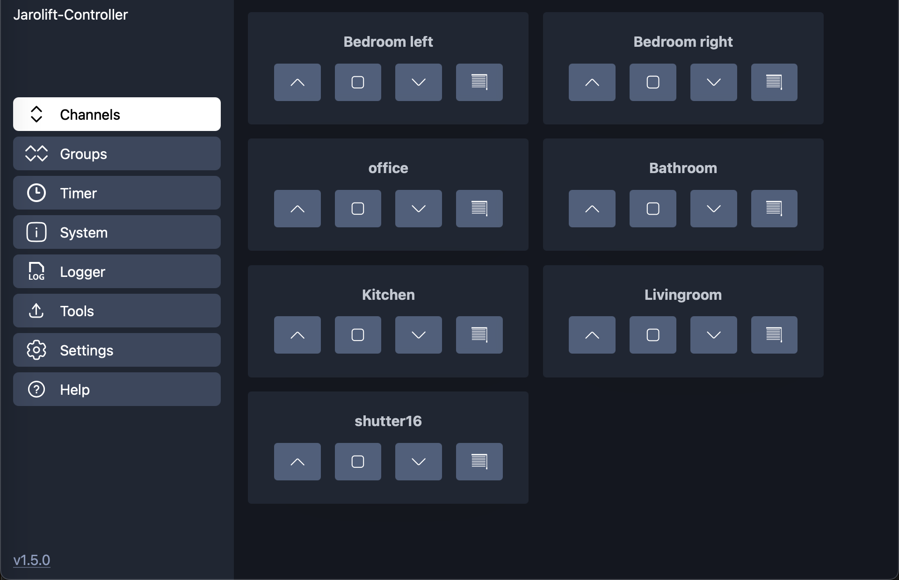
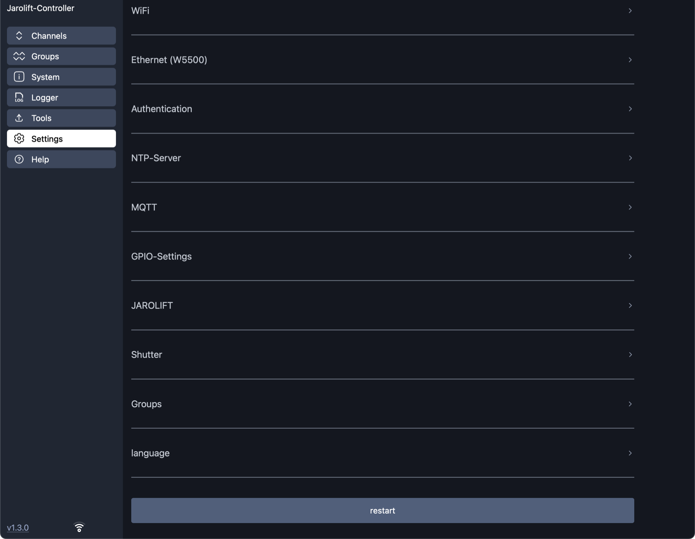

<div align="center">


<h3 style="text-align: center;">ESP32-Jarolift-Controller</h3>
</div>

-----

**[🇬🇧  english version of this description](README.md)**

-----

<div align="center">

[](https://github.com/dewenni/ESP32-Jarolift-Controller/releases/latest)


[](https://github.com/dewenni/ESP32-Jarolift-Controller/stargazers/)

</div>

-----

<div align="center">
Wenn dir dieses Projekt gefällt, drücke genre auf den <b>[Stern ⭐️]</b> Button and drücke <b>[Watch 👁]</b> um auf dem Laufenden zu bleiben.
<br><br>
Und wenn du meine Arbeit unterstützen möchtest, kannst auch folgendes nutzen <p>

[](https://github.com/sponsors/dewenni)

</div>

-----

# ESP32-Jarolift-Controller

Steuerung von Jarolift(TM) TDEF 433MHz Funkrollläden über **ESP32** und **CC1101** Transceiver Modul im asynchronen Modus.

## Features

- **Webbasierte Benutzeroberfläche (WebUI):**  
Eine moderne, mobilfreundliche Schnittstelle für einfache Konfiguration und Steuerung.

- **MQTT-Unterstützung:**  
Die Kommunikation und Steuerung der Geräte erfolgt über MQTT, ein leichtgewichtiges und zuverlässiges Messaging-Protokoll.

- **HomeAssistant-Integration:**  
Automatische Geräteerkennung in HomeAssistant durch MQTT Auto Discovery für nahtlose Integration.

- **Unterstützung für bis zu 16 Rollläden:**  
Steuern von bis zu 16 Rollläden, die alle über die WebUI und MQTT verwaltet werden.

- **Unterstützung für bis zu 6 Rollladengruppen:**  
Definiere bis zu 6 Rollladengruppen, um mehrere Rollläden auf einmal zu steuern

Die Verwendung erfolgt auf eigene Gefahr. Nur für den privaten/schulischen Gebrauch. (Keeloq-Algorithmus ist nur für TI-Mikrocontroller lizenziert)
Dieses Projekt ist in keiner Weise mit dem Hersteller der Jarolift-Komponenten verbunden.
Jarolift ist ein Warenzeichen der Schöneberger Rolladenfabrik GmbH & Co. KG

Diese Version ist für einen ESP32 und basiert auf Ideen und Code von [madmartin/Jarolift_MQTT](https://github.com/madmartin/Jarolift_MQTT).

### Project Homepage, Forum und Author

Der ursprüngliche Steuercode wurde von Steffen Hille im Nov. 2017 geschrieben.

Die Homepage des Projekts ist hier: [Project Home](http://www.bastelbudenbuben.de/2017/04/25/protokollanalyse-von-jarolift-tdef-motoren/)

-----


(Desktop Version)

Die WebUI ist responsiv und bietet auch ein mobiles Layout.


(Mobile Version)

-----

# Inhaltsverzeichnis

- [Hardware](#hardware)
  - [ESP32+CC1101](#esp32-+-cc1101)
  - [Optional: Ethernet Modul W5500](#optional-ethernet-modul-w5500)
- [Erste Schritte](#erste-schritte)
  - [Platform-IO](#platform-io)
  - [ESP-Flash-Tool](#esp-flash-tool)
  - [OTA-Updates](#ota-updates)
  - [Setup-Mode](#setup-mode)
  - [Konfiguration](#konfiguration)
  - [Filemanager](#filemanager)
  - [Migration](#migration)
- [MQTT](#mqtt)
  - [Kommandos](#kommandos)
  - [Home Assistant](#home-assistant)
- [Optionale Kommunikation](#optionale-kommunikation)
  - [WebUI-Logger](#webui-logger)
  - [Telnet](#telnet)

-----

# Hardware

## ESP32 + CC1101

eine Standard-SPI-GPIO-Konfiguration für den CC1101 und den ESP32 ist folgende:

|CC1101-PIN | CC1101-Signal| ESP-GPIO|
|-----------|--------------|---------|
|2          | VCC          | --      |
|1          | GND          | --      |
|3          | GD0          | 21      |
|8          | GD2          | 22      |
|5          | SCK/CLK      | 18      |
|6          | MOSI         | 23      |
|7          | MISO         | 19      |
|4          | CS(N)        | 5       |

  

  

  

Beispiel mit ESP32-Mini und CC1101

  

Beispiel für direkten Austausch mit ESP32-Mini und dem Custom Board von M. Maywald (vermutlich nicht mehr verfügbar)

## Optional: Ethernet Modul W5500

Es ist auch möglich, ein W5500 Ethernet-Modul an das Board oder einen generischen ESP32 anzuschließen.

> [!IMPORTANT]
> Das Anschlusskabel sollte so kurz wie möglich sein (ca. 10 cm).

Beispiel für einen generischen ESP32-Mini (Standard SPI Port wird vom CC1101 verwendet)

| Signal| GPIO |
|-------|------|
| CLK   | 25   |
| MOSI  | 26   |
| MISO  | 27   |
| CS    | 32   |
| INT   | 33   |
| RST   | 17   |

-----

# Erste Schritte

## Platform-IO

Die Software wurde mit [Visual Studio Code](https://code.visualstudio.com) und dem [PlatformIO-Plugin](https://platformio.org) erstellt.  
Nach der Installation der Software kannst du das Projekt von GitHub klonen oder als zip herunterladen und in PlatformIO öffnen.
Dann noch den `upload_port` und die entsprechenden Einstellungen in `platformio.ini` an deinen USB-zu-Seriell-Adapter anpassen den Code auf den ESP hochladen.

> [!NOTE]
> Python muss ebenfalls installiert sein, um das Projekt vollständig zu kompilieren. Der Ordner scripts enthält beispielsweise Skripte für die Erstellung der Webseiten, die beim Kompilieren des Projekts aufgerufen werden.

## ESP-Flash-Tool

In den Veröffentlichungen (Releases) befinden sich auch die Binärdatei der Software. Wenn du PlatformIO nicht verwenden willst, kannst du auch die Datei `esp32_jarolift_controller_flash_vx.x.x.bin` verwenden und direkt auf den ESP flashen. Diese bin-Datei ist bereits ein Fertig mit bootloader.bin, partitions.bin und der application.bin. Du kannst dieses Image auf den ESP an Adresse 0x00 flashen.  

**Windows**  
Es gibt verschiedene Tools, um Binärdateien auf den ESP zu übertragen.  
Eines davon ist [espressif-flash-download-tool](https://www.espressif.com/en/support/download/other-tools)

**macOS/Linux**  
Für Mac ist es schwierig, ein Tool mit einer grafischen Benutzeroberfläche zu finden, aber es kann einfach das esptool.py verwendet werden:

1. Terminal öffnen
2. esptool installieren: `pip install esptool`  
3. optional den Installationspfad abfragen: `welches esptool.py`  
4. Pfad setzen: `export PATH=„$PATH:/<Pfad>/esptool.py“` (<- ändere <Pfad> mit Ergebnis aus 3.)
5. Gehe zu dem Pfad, in dem sich die bin-Datei befindet
6. Device String abfragen: `ls /dev/tty* | grep usb` (verwende dies im nächsten Schritt für <UPLOAD-PORT>)
7. Upload: `esptool.py -p <UPLOAD-PORT> write_flash 0x00 esp32_jarolift_controller_flash_vx.x.x.bin`  

## OTA-Updates

Seit der Softwareversion 3.0 kannst du die Software auch mit dem neuen OTA Web-Upload aktualisieren.  
Du findest die Update-Funktion im Tab „Tools“ der WebUI.

Hier kannst du einfach die Datei `esp32_jarolift_controller_ota_update_vx.x.x.bin` aus dem Release-Bereich auswählen und das Update starten.


Aber es ist auch möglich, die Software drahtlos mit Platformio herunterzuladen.
Du musst nur die `upload_port` Einstellungen in der `platformio.ini` ändern.

Es gibt zwei vordefinierte Optionen:

- OPTION 1: direct cable upload
- OPTION 2: wireless OTA Update

## Setup Mode

Es gibt einen „Setup Mode“. Der „Setup Mode“ wird aktiviert, wenn der „Reset-Knopf“ des ESP zweimal innerhalb von 3 Sekunden gedrückt wird.
Der „Setup Mode“ wird auch aktiviert, wenn (zu Beginn) keine WLAN-Verbindung konfiguriert ist.

Wenn der ESP in den „Setup Mode“ geht, erstellt er automatisch einen eigenen Netzwerk Accesspoint mit der ssid
📶 `"ESP32_Jarolift"`  
Nachdem du mit diesem Netzwerk verbunden bist, kannst du die WebUI übernachfolgende Adresse öffnen  
**http://192.168.4.1**

## Konfiguration

Hier können alle Konfigurationen vorgenommen werden, die zu der Heizungsanlage und der Infrastruktur passen.

- **WiFi**  
Gib im Feld „WiFi“ deine WLAN Anmeldedaten ein, um den ESP mit Ihrem Netzwerk zu verbinden.

- **Ethernet W5500**  
Verwende optional die Ethernet-Verbindung auf Basis des W5500, um den ESP mit dem Netzwerk zu verbinden.

- **Authentifizierung**  
Hier kann optional die Authentifizierungsfunktion aktiviert werden und Benutzer und Passwort konfiguriert werden.

- **NTP-Server**  
Der ESP kann sich mit einem NTP-Server verbinden, um die richtigen Zeitinformationen zu erhalten.
Die voreingestellte Zeitzone sollte passen, wenn du dich in Deutschland befindest. Andernfalls können diese manuell geändert werden.

- **MQTT**  
hier können Sie die MQTT-Kommunikation aktivieren und obligatorische Parameter eingeben.  

- **GPIO**  
Hier kann man die GPIO konfigurieren, um den CC1101 mit dem ESP32 zu verbinden

- **Jarolift**  
Hier müssen bestimmte Jarolift-spezifische Protokolleinstellungen vorgenommen werden

- **Shutter**  
hier können die einzelnen Rollläden mit individuellen Namen konfiguriert werden

- **Group**  
Hier können wahlweise Rollladengruppen definiert werden

- **Language**  
Es sind zwei Sprachen verfügbar. Wählen deine bevorzugte Sprache.

> [!NOTE]
> Alle Einstellungen werden automatisch gespeichert, wenn Änderungen vorgenommen werden.

> [!IMPORTANT]
> Changes to GPIO or Jarolift settings require a restart!



## Filemanager

Es gibt es auch einen eingebauten Dateimanager zum Öffnen (anzeigen), Herunterladen (exportieren) und Hochladen (importieren) der Konfigurationsdatei.
Die Konfiguration wird in der Datei ``config.json`` gespeichert. Zur Sicherung und Wiederherstellung der Konfiguration kannst du diese Datei herunterladen und hochladen.


## Migration

Es ist möglich, von einer vorherigen Version von [madmartin/Jarolift_MQTT](https://github.com/madmartin/Jarolift_MQTT) zu diesem Projekt zu migrieren.

#### Ein funktionierendes Setup für dieses Projekt herstellen

- eine funktionierende Version dieses Projekts zum Laufen zu bringen
- die richtigen GPIO-Einstellungen für den CC1101 setzen
- die Master Keys setzen (entweder hat man die oder man findet sie)
- den Log-Level im Logger der WebUI auf „Debug“ setzen

#### Ermitteln Sie die richtige Seriennummer

- Führe einen Shutter HOCH Befehl des „alten“ Setups `(madmartin/Jarolift_MQTT)` für **Kanal 0!** aus.
- Du solltest nun eine Debug-Meldung dieses Befehls im Logger der WebUI sehen.  
Sie enthält eine Meldung mit `D (APP-JARO): (INF1) serial: 0xaabbcc00,`  
Die ersten 6 Ziffern sind die Seriennummer, die für dieses Projekt verwenden werden kann (in diesem Beispiel: **aabbcc**). Dies sollte die gleiche sein, die in der WebUI des „alten“ Setups konfiguriert wurde, aber jetzt sind wir sicher, dass wir die richtige haben.
- Setze diese Seriennummer in der WebUI dieses Projekts in den Einstellungen.


#### Den richtigen Gerätezähler finden

- den aktuellen Gerätezähler der „alten“ Konfiguration auf der System-Seite der WebUI ablesen.
- den gleichen Wert für den Gerätezähler in den Einstellungen dieses Projekts einstellen.


#### Die Rollläden definieren

- Definiere die gleichen Rolläden in der gleichen Reihenfolge wie in der „alten“ Einstellung und aktiviere diese.

fertig!  
Starte nun den ESP neu und teste.  
Prüfe nach dem Neustart zunächst, ob der Gerätezähler korrekt aus dem EEPROM gelesen wurde. Nur wenn dies der Fall ist, fahre mit dem Test fort.
Wenn alles richtig gemacht wurde, sollten alle Rollläden wie vorher funktionieren. Wenn nicht, ist eine Einstellung falsch oder du hast zuletzt nicht die neueste Version von `(madmartin/Jarolift_MQTT)` verwendet. In diesem Fall würde ich es vorziehen, eine neue Seriennummer zu setzen, den Gerätezähler zurückzusetzen und die Rolläden neu einzulernen.

-----

# MQTT

### zusätzliche Informationen (nur lesen)

Statusinformationen über WiFi:

```text
Topic: ESP32-Jarolift-Controller/wifi = {  
    "status":"online",  
    "rssi":"-50",  
    "signal":"90",  
    "ip":"192.168.1.1",  
    "date-time":"01.01.2022 - 10:20:30"  
}
```

## Kommandos

### Rolläden

Zur Steuerung der Rollläden können die folgenden mqtt-Befehle verwendet werden.
{UP, OPEN, 0} bedeutet, dass man einen der aufgeführten Payload-Befehle verwenden kann.

```text
command:    Neustart ESP
topic:      ../cmd/restart
payload:    none

command:    Rolladen hoch
topic:      ../cmd/shutter/1 ... cmd/shutter/16
payload:    {UP, OPEN, 0}

command:    Rolladen runter
topic:      ../cmd/shutter/1 ... cmd/shutter/16
payload:    {DOWN, CLOSE, 1}

command:    Rolladen stopp
topic:      ../cmd/shutter/1 ... cmd/shutter/16
payload:    {STOP, 2}

command:    Rolladen Schatten
topic:      ../cmd/shutter/1 ... cmd/shutter/16
payload:    {SHADE, 3}

```

### vordefinierte Gruppen

Zur Steuerung der Rollläden über eine vordefinierte Gruppe, können die folgenden mqtt-Befehle verwendet werden.
{UP, OPEN, 0} bedeutet, dass man einen der aufgeführten Payload-Befehle verwenden kann.

```text

command:    Gruppe hoch
topic:      ../cmd/group/1 ... cmd/group/6
payload:    {UP, OPEN, 0}

command:    Gruppe runter
topic:      ../cmd/group/1 ... cmd/group/6
payload:    {DOWN, CLOSE, 1}

command:    Gruppe stopp
topic:      ../cmd/group/1 ... cmd/group/6
payload:    {STOP, 2}

command:    Gruppe Schatten
topic:      ../cmd/group/1 ... cmd/group/6
payload:    {SHADE, 3}

```

### Gruppe mit Bitmaske

Man kann auch einen generischen Gruppenbefehl verwenden und die Bitmaske angeben, um die Rollläden direkt auszuwählen.  
Die Bitmaske ist eine 16-Bit-Zahl, wobei das niedrigstwertige Bit (rechts) für Kanal 1 steht.  
Ein gesetztes Bit bedeutet, dass der Kanal zu dieser Gruppe gehört.  

**Beispiel**: `0000000000010101` bedeutet, dass die Kanäle 1, 3 und 5 zu dieser Gruppe gehören.

Als Nutzdaten können Sie drei verschiedene Formate verwenden, um die gleiche Bitmaske darzustellen:

- **Binary**: `0b0000000000010101`
- **Hex**: `0x15`
- **Decimal**: `21`

```text

command:    Gruppe hoch
topic:      ../cmd/group/up
payload:    {0b0000000000010101, 0x15, 21}

command:    Gruppe runter
topic:      ../cmd/group/down
payload:    {0b0000000000010101, 0x15, 21}

command:    Gruppe stopp
topic:      ../cmd/group/stop
payload:    {0b0000000000010101, 0x15, 21}

command:    Gruppe Schatten
topic:      ../cmd/group/shade
payload:    {0b0000000000010101, 0x15, 21}

```


> [!NOTE]
> < ../ > ist der Platzhalter für das MQTT-Topic, das in den Einstellungen angegeben ist.

## Home Assistant

MQTT Discovery für Home Assistant macht es einfach, alle Werte in Home Assistant zu erhalten.
Die konfigurierten Rollläden werden automatisch als mqtt-Gerät in Home Assistant angezeigt, wenn HomeAssistant aktiviert ist.

siehe auch die: [offizielle Dokumentation](https://www.home-assistant.io/integrations/mqtt/#discovery-messages)


In den mqtt-Einstellungen können die Funktion zur Erkennung aktiviert sowie das mqtt-Topic und der Gerätename für den Home Assistant festgelegt werden.


-----

# Optionale Kommunikation

Zusätzlich zu mqtt gibt es weitere Kommunikationsmöglichkeiten.

## WebUI-Logger

Außerdem gibt es eine Log-Funktion, mit der je nach Filter verschiedene Meldungen aufgezeichnet und über die WebUI angezeigt werden können. Dies kann für das eigene Debugging und auch für die Weiterentwicklung der Software nützlich sein.


## Telnet

Neben der WebUI und MQTT gibt es auch eine Telnet-Schnittstelle zur Kommunikation mit dem ESP.
Die Schnittstelle bietet mehrere Befehle, um Informationen auszulesen und Befehle zu senden.
Eine Übersicht über die Befehle kann mit dem Befehl „help“ aufgerufen werden.
Um eine Verbindung herzustellen, kann eine einfache Telnet-Verbindung über die entsprechende IP-Adresse des ESP gestartet werden.

Beispiel:

`> telnet 192.168.178.193`


