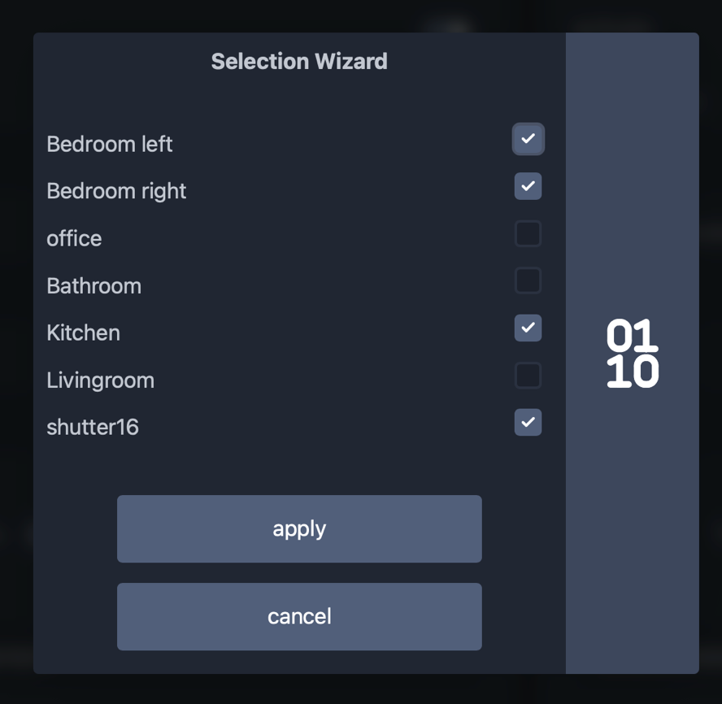

# v1.5.0

## what's new

This update brings a cool new feature 🎉🎉🎉

### 1. Timer Control

The timer function enables the automatic control of individual roller shutters or a selection of several roller shutters as a group.
A fixed time can be specified as a trigger, or sunrise or sunset with an optional time offset.
This controller can therefore also work well as a stand-alone solution without the need for further automation

The selection of roller shutters is supported by an additional dialogue. All configured and activated roller shutters are displayed there. These can be selected there and the bitmask is then automatically created from them.

> [!TIP]
> Maybe it is necessary to clean your browser cache after the update, to be sure that everything works well!

### encrypted Passwords

Passwords are now better protected and stored in encrypted form in the config.json
When updating, the existing passwords are automatically encrypted and saved again.

> [!CAUTION]
> As the passwords are stored in encrypted form after this update, it is no longer possible to switch to an older version without re-entering the passwords after the downgrade

## changelog

- [UPDATE] Arduino core 3.1.1 based on IDF 5.3.2.241224
- [UPDATE] mathieucarbou/AsyncTCP @ 3.3.2
- [UPDATE] mathieucarbou/ESPAsyncWebServer @ 3.6.0
- [FEATURE] new feature to define 6 individual timer to automatically move the shutters #4
- [FEATURE] new wizard for defining bit masks for timers and groups
- [IMPROVE] uploaded config files via "config-upload" are now automatically renamed to config.json, regardless of the original filename.
- [IMPROVE] Improved behavior when the restart button is pressed immediately after a change in the settings.
- [IMPROVE] Passwords are better protected and are stored in encrypted form

